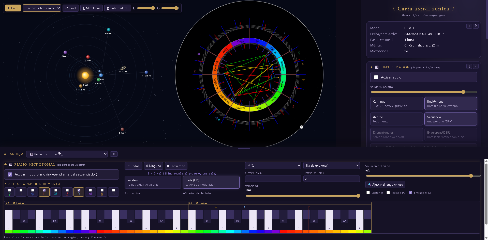

# Carta Astral Sónica · v2

Rueda zodíaco-musical interactiva con carta astral en tiempo real, sintetizador
y bancos de fechas disparables por MIDI.



## Estructura

```
web-v2/
├── index.html              ← versión pública
├── dev.html                ← versión privada con editor visual (gitignored)
├── style.css
├── .gitignore
└── js/
    ├── config.js
    ├── helpers.js
    ├── data.js
    ├── theme.js            ← THEME (colores, grosores, radios)
    ├── colors.js
    ├── synth.js            ← Web Audio: 10 osciladores, ADSR, modos
    ├── piano.js            ← Modo piano microtonal polifónico + su teclado
    ├── audio-outputs.js    ← Salidas de audio virtuales (setSinkId, para DAW externo)
    ├── banks.js            ← Bancos de fechas con overrides y MIDI binding
    ├── rhythms.js          ← Ritmos guardados y cadenas de ritmos
    ├── midi-map.js         ← Mapeo MIDI de parámetros (raíz, intervalo, ritmos)
    ├── midi.js             ← Web MIDI API: input
    ├── ephemeris.js
    ├── wheel.js
    ├── chart.js            ← Casas, planetas (texto/símbolo/imagen), aspectos
    ├── state.js
    ├── interaction.js      ← Toda la UI (synth, bancos, MIDI, formulario)
    ├── sketch.js
    ├── dev-panel.js        ← Editor visual del THEME (GITIGNORED)
    └── dev-panel.css       ← Estilos del editor (GITIGNORED)
```

## Correr

```bash
cd web-v2
python3 -m http.server 8000
```

- `http://localhost:8000` — versión pública
- `http://localhost:8000/dev.html` — versión con editor visual

**Nota MIDI:** Web MIDI funciona en `localhost` sin HTTPS en Chrome/Edge/Opera.
En Firefox necesitas activar `dom.webmidi.enabled` en `about:config`.

## Lo nuevo en esta entrega (septiembre 2026)

### 🔌 Salidas de audio virtuales (para Ableton y otros DAW)

El Mezclador (**🎚 Mezclador**) ahora tiene un bloque **Salidas virtuales**
arriba de los canales: **✚ Nueva salida** crea un bus de envío con nombre
editable, y su selector de dispositivo (**🔄 Dispositivos** los busca) lo
enruta a cualquier salida de audio del sistema — incluido un **cable de
audio virtual** (VB-Audio Virtual Cable, BlackHole…), que un DAW externo
como **Ableton** puede recibir como entrada de audio independiente.

Cada canal (Secuenciador, Piano y cada uno de los 10 astros) gana dos
controles nuevos debajo de Mute/Solo:

- Un selector **— Sin salida —** para mandarlo también a una de esas
  salidas virtuales (además de, o en vez de, sonar en el Maestro).
- El botón **Maestro**, que decide si ese canal suma o no al grupo del
  Maestro — así el Maestro deja de ser "todo junto siempre" y pasa a ser
  un grupo de canales del que puedes sacar o meter cada uno.

El Maestro en sí siempre suena por tus bocinas (no se puede redirigir);
solo las salidas virtuales que crees se enrutan a otro dispositivo, y
mientras no tengan uno asignado quedan silenciadas (para no duplicar el
sonido). Requiere un navegador con `HTMLMediaElement.setSinkId` (Chrome o
Edge); la primera vez que pides la lista de dispositivos, el navegador
pide permiso de micrófono una sola vez — es la única forma que tiene de
mostrar los *nombres* de los dispositivos de salida, no se graba nada.

### ▤ Bandeja inferior

El sintetizador y el piano microtonal quedaban muy separados en el panel
lateral: para comparar uno con otro había que desplazarse arriba y abajo.
Ahora cualquier sección del panel puede enviarse (botón **⤓**, junto al
**⧉** de desprender) a una **bandeja fija en la parte inferior de la
pantalla**:

- **Redimensionable**: arrastra la barra superior de la bandeja para
  cambiarle el alto.
- **Elige qué ver**: un selector en la propia bandeja cambia qué sección
  se muestra ahí, sin volver al panel — por ejemplo, deja el **sintetizador**
  arriba y trae el **piano microtonal** abajo, a la vista al mismo tiempo.
- Solo muestra una sección a la vez: al elegir otra, la anterior vuelve
  sola a su lugar en el panel lateral. El **✕** cierra la bandeja y también
  la devuelve.
- El alto y la sección visible se recuerdan entre sesiones.

### 🎛 Rack de sintetizadores

El volumen, los armónicos y el ADSR de cada astro vivían repartidos entre la
sección Secuenciador y la sección Piano (que en realidad no tiene timbre
propio: toca prestado el de los astros que elijas como instrumento). El botón
**🎛 Sintetizadores** de la barra superior abre una ventana flotante — estilo
la del Mezclador — con **una tarjeta por astro** y todos sus controles de
timbre juntos, sin tener que navegar entre secciones:

- **Octava** y **forma de onda**, sincronizadas con la fila equivalente del
  panel lateral.
- **Volumen** y **armónicos** (pares/impares) — tocar los armónicos cambia la
  forma de onda a "Personalizada" automáticamente, igual que en el panel.
- **ADSR**: una mini-gráfica arrastrable (ataque, decay/sustain, release) por
  astro; la curvatura de cada tramo sigue editándose solo desde el editor
  grande del panel lateral.
- **Profundidad FM propia** (`fmProfundidadAstro`, nuevo): un multiplicador
  0–2 sobre el knob global de profundidad FM, que solo pesa cuando ese astro
  actúa como **modulador** en la cadena del algoritmo FM activo.
- **Filtros HPF y LPF** (nuevos): frecuencia de corte (20 Hz–20 kHz) y
  resonancia (Q) por astro, en una cadena fija `gain → HPF → LPF` que no
  afecta el tap de modulación FM (sigue leyendo la señal cruda, antes de
  filtrar). El piano clona estos mismos filtros al tocar un astro como
  instrumento, igual que ya hace con su ADSR y sus armónicos.

## Lo nuevo en esta entrega (agosto 2026)

### 🎛 Mapeo MIDI de parámetros

Cuatro parámetros del programa se manejan ya desde el controlador, sin tocar el
panel. Están en **🎛 MIDI → ✦ Mapeo de parámetros**, una tarjeta por parámetro:

| Parámetro | Opciones |
|-----------|----------|
| **Transporte** | ▶ Play y ■ Detener del secuenciador |
| **Nota raíz** | las 12 notas que pueden caer en Aries |
| **Orden por intervalo** | los 10 intervalos de `INTERVALOS_ORDEN` |
| **Ritmos guardados** | carga en el secuenciador cualquiera de los ritmos |

El **Transporte** no elige un valor, dispara: **▶ Play** arranca la secuencia y,
si ya estaba sonando, la corta y la relanza **desde el primer paso** (la cadena
de ritmos también vuelve a su primer eslabón), así que el botón siempre deja
todo en el punto inicial. **■ Detener** corta. Con el modo Libre puedes ponerlos
donde quieras: dos pads, o un mismo botón CC repartido en 64–127 (Play) y 0–63
(Detener). El chip de la tarjeta muestra el estado real del secuenciador, se
dispare desde MIDI o desde el panel.

Cada uno se controla de una de tres formas:

- **Rango** — notas consecutivas a partir de la que le enseñes: la primera elige
  la opción 1, la siguiente la 2, y así (12 notas para la raíz, 10 para el
  intervalo, una por ritmo guardado). Es el atajo.
- **Libre** — despliega la lista completa de opciones y le pones a cada una **el
  mensaje que tú quieras**, en el orden que quieras: clic en su pastilla y tocas
  una nota **o mueves un control**; lo que llegue queda asignado. Las que dejes
  en «—» no responden, así que sirve igual para mapear las 12 raíces
  desordenadas que para mapear solo tres intervalos. El ✕ de cada pastilla quita
  su asignación y **✕ Vaciar** las quita todas.
- **CC** — una perilla o fader: su recorrido 0-127 se reparte entre todas las
  opciones del parámetro.

Cuando una opción del modo Libre queda mapeada a un **CC**, su pastilla muestra
los campos **valor min – max**: ese es el tramo que la dispara, y es lo que
permite repartir un mismo control entre varias opciones. Un botón que manda
CC 20 con 127 al pulsarlo y 0 al soltarlo elige una opción con el tramo 64–127 y
otra con el 0–63 —los que pone solo al aprender—, y un fader se puede cortar en
los tramos que quieras (0–41 / 42–84 / 85–127…). El disparo es **al entrar** en
el tramo, así que recorrerlo no reaplica en cada paso. Un mismo mensaje solo
puede estar en una opción del parámetro: si lo reasignas —la misma nota, o el
mismo CC con un tramo que se solapa— se le quita a la anterior.

En Rango y CC el botón **Aprender** deja la tarjeta a la espera: tocas la nota
que arranca el rango, o mueves el control, y queda asignado. Cada tarjeta tiene
además su **canal** (Todos, o uno de los 16) para que los mapeos convivan con el
piano y los bancos sin robarse notas; si dos parámetros se pelean por la misma
nota en el mismo canal, el panel lo avisa.

Aparte del rango, **cada ritmo guardado puede llevar su propia nota MIDI** (el
botón 🎹 de su tarjeta, igual que los bancos). Es la misma nota que aparece en la
lista del modo Libre —una sola fuente de verdad, se edite donde se edite— y
funciona siempre, aunque el parámetro "Ritmos guardados" esté en Off, con
prioridad sobre el rango. El ritmo cargado —a mano, por MIDI o por la cadena— se resalta en la
lista.

Orden de prioridad de una nota entrante:
`captura → bancos → mapeos de parámetros → piano → astros → envelope`.

### 🥁 Ritmos guardados y cadenas de ritmos

Los **🎲 Ritmos aleatorios** ya no se pierden: el que te guste se guarda y
sirve de material para armar secuencias más largas.

- **Guardar ritmo actual**: toma una foto del patrón rítmico — la figura de
  cada astro (las filas en "=" se resuelven a la figura global, así el ritmo
  suena igual aunque después cambies la figura de ejecución) y la
  **alineación de astros** con la que se escuchó. Cada ritmo se renombra, se
  duplica (⧉), se recaptura (📸) o se borra (🗑), y **▸** lo devuelve al
  secuenciador.
- **Vista previa**: los diez astros con su figura, en el orden en que se
  escuchan.
- **Transformaciones** sobre cualquier ritmo guardado:
  - **↔ Invertir la dirección**: el ritmo se escucha de atrás hacia adelante.
  - **◑ Empezar desde la mitad**: lo rota media vuelta.
  - **− Reducir / ＋ Aumentar**: cada figura salta al siguiente símbolo
    rítmico de la lista, que va de la más larga a la más corta pasando por
    los tresillos (blanca → tresillo de blancas → negra → tresillo de negras
    → corchea…). Las figuras que ya tocan un extremo se quedan ahí.
- **Cadena de ritmos**: una lista libre de eslabones sobre los ritmos
  guardados. Puede usar **cualquier número de ritmos y repetirlos** (el
  mismo ritmo puede aparecer en varios eslabones, y cada eslabón tiene su
  propio **×N**). Con **Encadenar ritmos al reproducir** activo, al dar Play
  el secuenciador toca el ritmo del eslabón 1 durante N vueltas completas
  del recorrido de astros, luego el del 2, y al terminar el último vuelve a
  empezar. El eslabón que suena se resalta con su cuenta de vueltas
  (`2/3`), y al parar vuelve el patrón que tenías a mano.

### 🔧 Arreglos

- **Puente de conjunción visible**: los astros que caen en la misma región
  no se unen con una cuerda (sería un punto), sino con un arco. Ese arco
  tenía un ancho fijo suelto y podía quedar fuera de la banda visible; ahora
  **va de un astro al otro** (más el margen del tema), se acota entre el rim
  de los planetas y el anillo de color, y baja una **patita a cada astro**
  para que se vea qué dos cuerpos conecta.
- **Octavas negativas legibles**: el `<select>` de OCT en las filas del synth
  perdía el dígito por la flecha nativa del navegador (`-1` se leía `-`).

### 🎹 Piano microtonal

Un modo de ejecución nuevo e **independiente del secuenciador**: los astros
dejan de ser "una nota fija cada uno" y pasan a ser **instrumentos**. El
teclado aporta la altura; cada astro aporta su timbre, su octava, su volumen
y su ADSR.

- **Polifónico**: hasta 12 notas simultáneas, con voces propias. Puede tocarse
  encima del drone o del secuenciador sin interferir con ellos.
- **Uno o más astros a la vez**, en **paralelo** (suma aditiva de timbres) o en
  **serie** (cadena FM: el último modula al anterior y solo el primero sale).
  El orden de la cadena es el mismo del secuenciador.
- **Las teclas son las regiones de la rueda**: una octava del piano = una
  vuelta completa, o sea tantas teclas como microtonos haya. Al cambiar
  microtonos, nota raíz o intervalo de orden, el teclado se redibuja.
- **Visualización de la octava**: líneas doradas marcan dónde termina cada
  vuelta, con el nombre de la nota donde empieza y cuántas teclas la componen.
  Es lo que permite orientarse cuando la octava ya no cae cada 12 teclas.
- **Tres tipos de tecla**: claras (naturales) y oscuras (alteradas) son las
  notas que existen en el piano de 12; las violetas más cortas son las
  **intermedias** que solo aparecen en la escala microtonal (a más de 24 cents
  de cualquier semitono).
- **Franja de color** bajo las teclas con la paleta de la rueda: cada tecla
  lleva el color de su región.
- **Marcadores de astro**: el símbolo de cada astro sobre la tecla de su
  región, con una **aguja** en su posición fraccionaria exacta dentro de ella,
  y en la octava que le corresponde según su ajuste de octava. Si aparece
  `‹` o `›`, su octava queda fuera del rango dibujado.
- **Afinación del teclado**: *Escala* (las regiones tal cual) o *Anclada al
  astro en foco*, que desplaza todo el teclado los cents necesarios para que
  la tecla del astro suene en su altura continua real. Con el anclaje activo,
  las notas sostenidas se reafinan en vivo mientras la carta se mueve.
- **Cómo se toca**: clic y arrastre sobre el teclado (glissando), teclado del
  ordenador (`zxcvbnm` / `asdfghjkl` / `qwertyuiop` = 26 pasos consecutivos,
  `,` y `.` cambian de octava) o **MIDI**, donde una tecla del controlador =
  un microtono y Do4 es el primer paso de la escala.
- Pedal de **sostener**, control de **velocidad**, rango de octavas visibles
  y botón de pánico (**Soltar todo**).

## Lo nuevo en la entrega de junio 2026

### 🎹 Sintetizador
- **FM estilo Operator**: los astros se pueden conectar en **paralelo**
  (aditivo, default) o en **cadenas en serie**. Los astros superiores
  modulan la frecuencia de los de abajo y solo los *carriers* llegan a
  la salida. El **esquema de conexión** se dibuja en vivo (SVG) y
  refleja el algoritmo y qué astros están activos. Slider de
  **profundidad FM** (índice 0–20).
- **Todas las combinaciones Paralelo(n) × Serie(n)**: de 2 cadenas
  (5+5) hasta 9 cadenas (2+1×8), más paralelo total y serie de 10. Una
  **galería de mini esquemáticos** clicables muestra cada combinación;
  el reparto de astros por cadena sigue el orden de las filas.
- **Gráfica de barras de armónicos**: la sección de armónicos
  pares/impares muestra el espectro resultante (fundamental + 24
  armónicos, pares en azul e impares en verde). Se actualiza en vivo y
  **se puede dibujar arrastrando las barras**.
- **Drag & drop en el esquema FM**: arrastra el símbolo de un astro y
  suéltalo sobre otro para reubicarlo en las cadenas (cambia el orden y
  por tanto quién modula a quién, igual que reordenar las filas).
- **Curvas ADSR**: cada tramo (attack, decay, release) tiene un **rombo
  en su centro**; arrastrarlo verticalmente curva el tramo como un arco
  (cóncavo o convexo, c=0 vuelve a lineal). La curvatura es global o por
  astro, se guarda con el resto de la config y **se oye**: el envelope
  se programa muestreando la curva.

### 🎶 Secuenciador
- **Alineamiento de astros**: botones para reordenar la secuencia de un
  golpe — **☉→♇** (Sol a Plutón), **♇→☉** (inverso), **🎲 Azar** (orden
  aleatorio) y **≈ Región** (agrupa los astros cuyas notas caen en
  regiones tonales cercanas, ordenando por microtono).
- **Ritmos aleatorios con pesos**: cada figura rítmica tiene un chip con
  peso ×0–×3 (clic para ciclar); **🎲 Ritmos aleatorios** asigna a cada
  astro una figura sorteada según esos pesos (×0 excluye la figura). Los
  pesos se guardan con la config del synth.
- **Unificar ritmo**: el botón **♩ Unificar ritmo** limpia las figuras
  por astro y todas las filas vuelven a la figura global ("=") — un solo
  valor rítmico para toda la secuencia.
- **Figura rítmica por astro**: en modo secuencia cada fila tiene una
  columna **Fig** con su propia figura (blanca…semifusa y tresillos);
  "=" usa la figura global. La duración de cada paso la marca la figura
  del astro que toca. Se captura en los overrides de los bancos (📸).
- **Forma de onda por astro**: Senoidal, Triangular, Cuadrada, Sierra,
  Ruido (filtrado pasa-banda centrado en la frecuencia del astro) y
  **Personalizada** con sliders de **armónicos pares e impares**.
- **Volumen individual** por astro (slider en cada fila).
- **Secuenciador**: figura de ejecución seleccionable — blanca, negra,
  corchea, semicorchea, fusa, semifusa **y sus tresillos**. BPM ampliado
  a **10–999** con entrada numérica.
- **Colores por región tonal**: cada fila del synth lleva una franja con
  el color de la región (microtono) donde está su astro; los astros que
  comparten región se pintan con el color de esa región.
- **MIDI → astros**: desde Do4 (nota 60) cada nota de la octava dispara
  un astro: C4=Sol, C#4=Luna … A4=Plutón (activable en el panel MIDI).

### 🌌 Gráfico
- **Vista Sistema solar**: heliocéntrica en tiempo real, con órbitas,
  la Luna junto a la Tierra y **líneas de conexión Tierra ↔ astros**.
  El astro que está sonando se resalta con un halo pulsante.
- **Vista Observatorio**: panorama azimut/altitud desde la ubicación
  configurada, con horizonte, puntos cardinales y cielo día/noche según
  la altitud del Sol. Los astros bajo el horizonte se ven atenuados.
- La **carta astral sigue siendo la vista principal**: cualquiera de las
  dos vistas se puede poner **de fondo** y la carta se puede **ocultar**
  con el botón "☉ Carta" (toolbar sobre el canvas).
- **Orientación corregida**: Aries empieza en las **5:00** del reloj y
  los signos/astros avanzan **contra reloj** (Piscis ocupa 6:00→5:00).
- La **ventana del sintetizador se puede ocultar** (clic en su título) y
  el **panel lateral completo** con el botón "⇄ Panel".
- **Opacidad del panel lateral** (slider ◧ en la toolbar): al bajarla,
  el gráfico ocupa todo el ancho y el panel **flota translúcido** encima,
  con un mínimo de opacidad en las tarjetas y blur de respaldo para que
  el texto siga legible sobre cualquier fondo.
- **Trazos persistentes** (sección "🌠 Sistema solar"): los astros
  marcados dibujan su **estela** al desplazarse por la vista Sistema
  solar, con duración configurable (0 = permanente, el alpha se
  desvanece con la edad) y botón para limpiar.
- **Modos de trazo**: la estela clásica quedó como modo **◌ Órbita**;
  el nuevo modo **✦ Vértice** traza el recorrido del **vértice (centro
  geométrico)** generado por dos o más astros marcados al orbitar,
  dibujando además las líneas de cada astro al vértice y un marcador.
  El color del trazo es la mezcla de los colores de los astros
  participantes; el modo elegido se recuerda (`cas-vistas-v1`).
- **Navegación por el Sistema solar**: **rueda = zoom hacia el cursor**
  (hasta ×120, los textos no crecen más de 2×), **arrastrar = mover la
  vista** y **doble clic = restablecer**. La cámara se recuerda entre
  sesiones.
- **Fix**: mover un fader/slider sobre el canvas ya no arrastra la
  cámara del Observatorio ni la mini-carta — los handlers de p5 ahora
  ignoran los eventos que nacen en la UI del DOM.
- **Fix**: con el Sistema solar de fondo se puede volver a desplazar el
  tiempo (y ver los astros orbitar): **Shift+rueda** mueve el tiempo en
  EXPLORACIÓN y la rueda sola sigue haciendo zoom hacia el cursor.

### 🧭 Panel lateral
- **Estética holística/mística**: el panel pasó a una paleta de índigo
  profundo con acentos dorados y violeta, títulos en serif con espaciado
  amplio, ornamentos ✦/☾ y brillos suaves. Todo en `style.css` (los
  colores del canvas siguen viviendo en el THEME).
- **Secciones compactables**: clic en el título de cualquier sección la
  compacta a una línea (estado recordado).
- **Ventanas individuales**: el botón **⧉** desprende la sección como
  ventana flotante arrastrable sobre el gráfico; **⏎** la devuelve a su
  lugar en el panel. Posición y secciones desprendidas se recuerdan
  (`cas-panel-v1`). La vista de panel completo sigue disponible.

### 🎵 Bancos de fechas
- **Grupos**: cada banco tiene un campo **grupo**; los bancos se agrupan
  por su nombre de grupo y los que no tienen grupo se agrupan por fecha.
  Cada grupo se puede **compactar/expandir** (estado recordado).
- **Ocultar bancos**: botón 🙈 por banco y toggle **👁 Ocultos** en el
  toolbar para mostrarlos u esconderlos todos.

### 🎼 Notas
- **Microtonos escribibles** (entrada numérica) con **máximo 96**.
- **Orden de notas configurable**: nota raíz (cuál cae en Aries) y orden
  por intervalo — cromático (2m, default), 2M, 3m, 3M, 4J y sus espejos
  5J, 6m, 6M, 7m, 7M. Con intervalos que no recorren las 12 notas, al
  chocar con una nota usada se toma la siguiente libre.

### 📅 Datos
- **Búsqueda de lugar** (Open-Meteo geocoding): escribe la ciudad y al
  elegir un resultado se llenan **País, Estado, Ciudad, latitud,
  longitud y zona horaria** automáticamente.
- **Fechas sin límite**: año + era (**a.C. / d.C.**), sin mínimo de 1990.
  Internamente se usa el año astronómico (1 a.C. = año 0).

## Entrega anterior

### 🪐 Astros: visualización configurable

Los nombres largos de los planetas (Mercurio, Jupiter, Capricornio...) ya no se
encimaban porque ahora se puede elegir cómo mostrarlos:

- **Texto** — nombre completo (modo original)
- **Símbolo** — glifos astrológicos Unicode (☉ ☽ ☿ ♀ ♂ ♃ ♄ ♅ ♆ ♇)
- **Imagen** — sube un PNG/SVG por astro

Además, en `dev.html`:
- **Color e imagen por astro** — cada uno tiene su color y opcionalmente una
  imagen propia.
- **Radio del texto/símbolo/imagen** ajustable: 200–450 (unidades base).
- **Radio del punto** ajustable: 100–320.
- **Radio del inicio de la línea radial** ajustable: 100–280.

Esto te deja poner los símbolos cerca del rim externo y los puntos en el rim
interno, o cualquier otra configuración.

### ☌ Conjunción visible (fix)

Las conjunciones ahora se ven. Como una cuerda entre dos puntos casi en el
mismo lugar es invisible, el código dibuja un **arco** entre los dos cuerpos.
El bug era un ajuste de `-90°` que ya estaba aplicado en otra parte y se
duplicaba: el arco terminaba en el lado opuesto del círculo, oculto.

Configurable en `dev.html`:
- **Arco conjunción (semi-anchura grados)** — 2–20
- **Radio del arco conjunción** — 100–350
- **Orbe (grados)** — 0–12 (también aplica a los otros aspectos)

### 🎹 Sintetizador: dos dimensiones de modo

**Modo de mapeo posición → frecuencia:**
- **Continuo** — 360° = 1 octava, glissando suave
- **Región tonal** — nota fija dentro de cada microtono

**Modo de disparo (nuevo):**
- **Drone (toggle)** — sonido continuo on/off, como hasta ahora
- **Envelope (ADSR)** — cada nota tiene attack/decay/sustain/release

Cuando el modo de disparo es **Envelope**:
- Marcar/desmarcar el checkbox dispara `triggerAttack` / `triggerRelease`.
- Aparece un botón **▶** momentáneo por cada planeta (mantener presionado =
  attack, soltar = release).
- Las notas MIDI `noteOn`/`noteOff` también disparan attack/release de los
  planetas activos.

**ADSR configurable** desde la UI:
- Attack: 0.001 – 3 s
- Decay: 0.001 – 3 s
- Sustain: 0 – 100 %
- Release: 0.001 – 5 s

Los valores se guardan en `localStorage` junto con el resto de config del synth.

Visualmente, cuando un planeta está sonando con envelope, su punto en la rueda
muestra un anillo **naranja** (en modo drone es **verde**).

### 🎵 Bancos de fechas

Panel "🎵 Bancos de fechas" en la columna derecha. Cada banco guarda:

- **Fecha y hora local** + zona UTC
- **Ubicación** (nombre, lat, lon)
- **Octavas override** (opcional) — array de 10 octavas por planeta
- **Microtonos override** (opcional)
- **Modo musical override** (opcional, cromático/quintas)
- **Nota MIDI asignada** (opcional)

**Acciones por banco:**
- **▶** disparar — carga la fecha+lugar+overrides
- **📸** capturar — guarda la config actual (octavas, microtonos, modo) como
  override del banco
- **∅** limpiar override — quita los overrides para que use la config global
- **⎘** duplicar
- **🗑** borrar
- **Asignar** — entra en modo captura: la próxima nota MIDI que llegue se
  asigna como trigger de este banco
- **✕** — quita la nota MIDI asignada

**Crear un banco:**
1. Ajusta la rueda a la fecha/ubicación/octavas/microtonos que quieras
2. Click en **+ Nuevo** → crea un banco con todo eso ya capturado
3. Renómbralo si quieres

**Disparar con MIDI:**
1. Conecta un teclado MIDI USB
2. Click en **Activar MIDI**
3. En la tarjeta del banco, click en **Asignar** (queda amarillo, esperando)
4. Toca la nota en el teclado MIDI → queda registrada
5. A partir de ahora, esa nota dispara el banco

**Export/Import:** botones en el toolbar guardan/cargan toda la colección
como JSON.

Persistencia: `localStorage` con clave `cas-banks-v1`.

### 🎛 MIDI

Panel "🎛 MIDI" en la columna derecha:
- Activar/desactivar (usa Web MIDI API, requiere consentimiento del navegador)
- Lista de dispositivos detectados
- Estado en tiempo real

**Cómo se interpretan los mensajes:**
- **Note On** con nota asignada a banco → dispara ese banco
- **Note On** sin banco asignado + synth en modo Envelope → `triggerAttack`
  de todos los planetas activos
- **Note Off** + synth en modo Envelope → `triggerRelease` de planetas activos
- **CC** — reservado para futuro

## Persistencia

Sistemas independientes en `localStorage`:

| Clave | Contenido |
|-------|-----------|
| `cas-theme-v1` | Colores, grosores, radios, imágenes por astro |
| `cas-synth-config-v1` | Modo, octavas, volumen, ADSR |
| `cas-banks-v1` | Lista de bancos de fechas |
| `cas-piano-v1` | Modo piano: astros, ruteo, anclaje, octavas, opciones |
| `cas-ritmos-v1` | Ritmos guardados (con su nota MIDI), cadena de ritmos y si está encadenada |
| `cas-midi-map-v1` | Mapeo MIDI de parámetros: modo, nota base / CC, canal y asignaciones del modo Libre |

## Controles teclado

| Tecla | Acción |
|-------|--------|
| `D` / `A` / `E` | Modo DEMO / AHORA / EXPLORACIÓN |
| `M` | Cromático ↔ círculo de quintas |
| `+` / `-` | Microtonos |
| Rueda | Desplazar tiempo (en EXPLORACIÓN; con el Sistema solar de fondo usa Shift+rueda) |
| `[` / `]` | Cambiar paso temporal |
| `0` | Volver al presente |
| `Espacio` | Pausa / reanuda (en AHORA) |
| Clic en planeta | Alternar su sonido (drone) o triggerAttack/Release (envelope) |
| `zxcvbnm` `asdfghjkl` `qwertyuiop` | Tocar el piano microtonal (solo con **Teclado PC** activo; mientras tanto las letras no ejecutan los atajos de arriba) |
| `,` / `.` | Bajar / subir una octava el teclado del ordenador |

## Ideas para después

- Filtro por planeta
- Sonificación de aspectos como intervalos audibles
- Sistema de casas Placidus (actual: Equal)
- Persistir la vista elegida (carta/fondo) entre sesiones
- Ratios FM por par modulador/carrier (como el coarse/fine del Operator)
- Grabar y reproducir lo tocado en el piano microtonal
- Escalas del piano por selección de regiones (modos/escalas dentro de la rueda)
